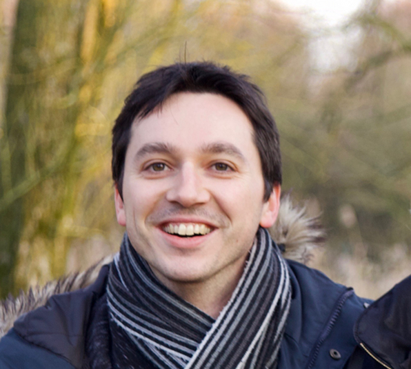

<h2>A scientist fascinated by plants</h2>

<strong>2006-2009:</strong> I obtained my PhD in Plant Molecular Biology on the role of the ethylene signalling pathway in plant-bacteria interactions (2006-2009, University of Montpellier, France).
  This gave me a strong background in common tools used on the <em>Arabidopsis thaliana</em>
  a model plant species (PCR, qPCR, genotyping, mutant analysis, etc.).  
<strong>2010-2014:</strong> Following my PhD, I studied seed germination using "omics" techniques (transcriptomics, proteomics, metabolomics) at the Jean-Pierre Bourgin Institute (INRA Versailles, France). I worked on both basic research (Arabidopsis seed germination) and applied research (NUTRICE project to develop innovative rice cookers). There, I started to learn about data analysis using R and RStudio. 
<strong>2014-2017:</strong> I started a second post-doctoral position at the University of Amsterdam
to improve tomato resistance to insect pests. During my work, I generated and analysed genomic datasets (DNA-Seq, RNA-Seq) which posed a considerable challenge in terms of analysis.
Thankfully, I obtained a Marie-Curie Sklodowska Individual Fellowship (DURETO - 655656) to train myself thoroughly in programming, bioinformatics and data analysis (e.g. Machine Learning).
.  
<strong>2017-present:</strong> Presently, I  work at the University of Amsterdam as a Data Scientist
 and Community Lead for researchers from two institutes of the Faculty of Science (<a href="http://sils.uva.nl/">SILS</a> and <a href="http://ibed.uva.nl/">IBED</a>). I provide support in Data Science and Data Stewardship to wet-lab biologists that have little knowledge in programming and data analysis.  

<h2>A plant biologist passionate about the next genomic frontiers</h2>
Since a decade now, the onset of Next-Generation Sequencing techniques has revolutionized our ability
to decipher the DNA sequence of an organism. Moreover, this technology has now became cheap and
accessible (<a href="https://www.nature.com/news/technology-the-1-000-genome-1.14901">Technology: the $1,000 genome (2014)
<em>Nature</em></a>).
Yet, while the technical part has become affordable, it still requires considerable know-how to analyse these types of data.
 
Please contact me to see what we can do together to get the most out of genomic datasets.
<a class="radius button small" href="{{ site.url }}{{ site.baseurl }}/documentation/">Contact me</a>

<h2>A recent entrepreneur, founder of BioData Services</h2>

In 2018, I have founded the <strong> BioData Services </strong> company to support small and medium-size
plant breeding companies for their needs in bioinformatics & genomics analyses.
In coordination with <a href="https://jr.agency/">Johan Roche</a>, a freelance web designer,
I can also build dedicated breeding databases to efficiently manage plant germplasm.

<h2>A supporter of academic researchers</h2>

On the academic side, I am employed at the University of Amsterdam among the <a href="http://gls.uva.nl/">Green Life Sciences research cluster</a>
to support fellow researchers in programming and data analysis related to basic and applied plant research.
In addition, I regularly organise Software and Data Carpentry training workshops.
 
Please visit <a href="www.mgalland.info">my personal academic website</a> for more information

